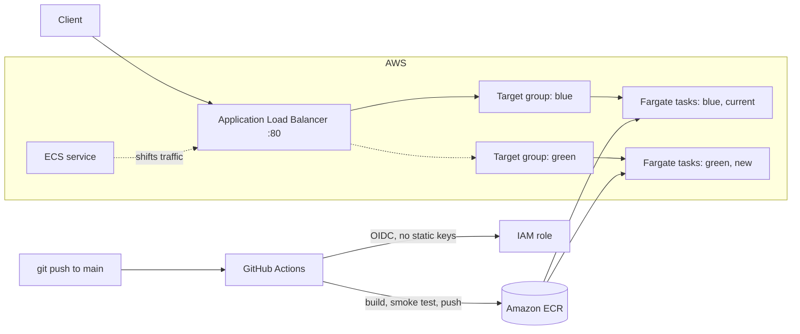

# ecs-fargate-bluegreen

A small FastAPI notes API, containerized with Docker and deployed on **AWS ECS Fargate** behind an **Application Load Balancer**, with **native ECS blue/green deployments** (defined in CloudFormation). Images are built and pushed to **ECR** by **GitHub Actions** using **OIDC** (no long-lived AWS keys).

Built as an AWS Developer Associate (DVA-C02) portfolio project. It is designed to cost nothing while idle: the stack is created only for short deployment windows and destroyed afterwards.

## Architecture



## API

| Method | Path | Description |
|--------|------|-------------|
| GET | `/health` | Used by the ALB target group health check |
| GET | `/version` | Returns `version`, `color` and container `hostname` (makes a blue/green switch visible) |
| POST | `/notes` | Create a note |
| GET | `/notes` | List notes |
| GET | `/notes/{id}` | Get a note |
| DELETE | `/notes/{id}` | Delete a note |

Notes are stored in memory on purpose: the focus is the deployment pipeline, not the database.

## Repository layout

```
app/                      FastAPI application
Dockerfile                Image definition (non-root user)
.github/workflows/        CI: build, smoke test, push to ECR
iam/                      OIDC trust policy and ECR push policy for the CI role
ecr/lifecycle-policy.json Keep only the 5 most recent images
infra/template.yaml       CloudFormation: ALB, ECS service with native blue/green
scripts/                  deploy.sh, teardown.sh, check-costs.sh
```

## CI: build and push

On every push to `main`, GitHub Actions:

1. Assumes an IAM role through GitHub's OIDC provider. The trust policy is limited to this repository and the `main` branch.
2. Builds the Docker image tagged with the commit SHA.
3. Runs a **smoke test**: starts the container in the runner and calls `/health` and `/version`.
4. Pushes the image to ECR (scan on push enabled).

The role can only push to this one ECR repository; the single action with `Resource: "*"` is `ecr:GetAuthorizationToken`, which AWS does not allow to be scoped.

## Infrastructure and blue/green

`infra/template.yaml` defines an ECS service that uses the built-in `BLUE_GREEN` deployment strategy. Two target groups (blue and green) sit behind one listener, and a listener rule carries the production traffic. Changing the task definition (for example `AppVersion`) makes ECS start the new (green) tasks, wait for them to be healthy, shift the listener rule to the green target group, keep both versions for a short bake time, and then stop the old one. If the new version does not become healthy, the deployment circuit breaker rolls back automatically.

An earlier version of this project used the CloudFormation `AWS::CodeDeploy::BlueGreen` hook. The AWS account's plan did not have access to CodeDeploy (`SubscriptionRequiredException`), so the project uses ECS's native blue/green strategy, which needs no additional service.

Notable choices:

- Tasks run in public subnets with a public IP and a security group that only accepts traffic from the ALB. This avoids a NAT gateway, which bills hourly.
- Smallest Fargate size (0.25 vCPU, 0.5 GB), one task, log retention of one day.
- Target group deregistration delay of 5 seconds and a 1-minute bake time so deployments and teardown finish quickly.
- Two IAM roles with separate purposes: the task execution role (pull image, write logs) and an ECS infrastructure role that lets ECS manage the load balancer during traffic shifts.

## Cost safety

The ALB, Fargate tasks and public IPv4 addresses are billed per hour while they exist, so the project is built around short-lived deployments:

- `./scripts/deploy.sh --preview` creates only a change set. Nothing is provisioned, so it is free.
- `./scripts/deploy.sh` shows a cost warning and requires typing `SI` before creating anything.
- `./scripts/teardown.sh` deletes the whole stack and then runs `./scripts/check-costs.sh`, which lists any load balancer, running task, NAT gateway, Elastic IP or leftover stack.
- Deployments are never triggered automatically from CI.
- An AWS Budgets zero-spend alert is configured on the account.

## Usage

Requirements: AWS CLI configured, a default VPC in the region.

```bash
# Run the API locally (no Docker needed)
python3 -m venv .venv && source .venv/bin/activate
pip install -r requirements.txt
uvicorn app.main:app --reload

# Validate the infrastructure without creating anything
./scripts/deploy.sh --preview

# Deploy (billed per hour while it exists), then trigger a blue/green update
./scripts/deploy.sh
APP_VERSION=2.0.0 DEPLOY_COLOR=green ./scripts/deploy.sh

# Always finish with
./scripts/teardown.sh
```

## Troubleshooting notes

- **OIDC `Not authorized to perform sts:AssumeRoleWithWebIdentity`** even with a correct trust policy: the `sub` claim in this repository's token included immutable owner and repository IDs (`repo:<owner>@<id>/<repo>@<id>:ref:refs/heads/main`) instead of the classic `repo:<owner>/<repo>:ref:...` format. A temporary workflow step that decoded and printed the token claims revealed the real value; the trust policy now matches it exactly.
- **`SubscriptionRequiredException` from CodeDeploy**: the first stack creation succeeded but the CodeDeploy hook failed on update with "The AWS Access Key Id needs a subscription for the service". `aws deploy list-applications` returned the same error, which showed it was an account-level restriction and not a template problem. The design was changed to ECS native blue/green.
- **Smoke test failing with curl exit code 56**: the published port accepts connections before uvicorn is ready. Fixed with `--retry-all-errors`, and the workflow now prints container logs when the smoke test fails.

## DVA-C02 mapping

| Decision | Domain |
|----------|--------|
| OIDC federation instead of access keys; trust policy scoped to repo and branch | Security |
| Least-privilege ECR push policy, scan on push | Security |
| CloudFormation with ECS blue/green, health-checked target groups, circuit breaker rollback | Deployment |
| CI pipeline with a smoke test gate before pushing the image | Deployment |
| Container logs in CloudWatch Logs; failure logs surfaced in CI | Troubleshooting and monitoring |

## Status

- [x] FastAPI notes API
- [x] CI: build, smoke test and push to ECR with OIDC
- [x] CloudFormation template accepted by CloudFormation (change set preview)
- [ ] Live deployment and blue/green switch verified end to end
